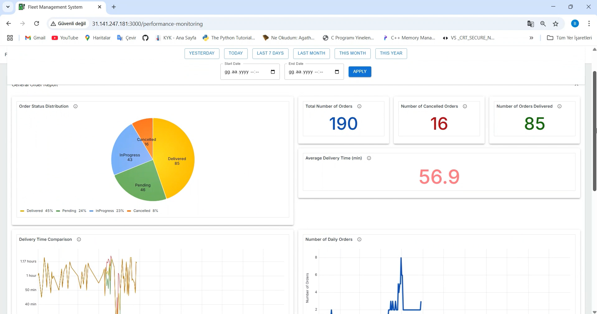

# EV Fleet Management System

This project is an innovative fleet management system specifically designed for electric vehicles (EVs). The system consists of two main modules: Vehicle Tracking Module and Performance Monitoring Module, providing comprehensive solutions for efficient EV fleet management.

---

## Key Features

### Vehicle Tracking Module
- **Real-time Monitoring**: Vehicle location, speed, energy consumption, and remaining range.  
- **Battery Management**: Continuous monitoring with critical alerts.  
- **Route & Delivery Tracking**: Rota ilerleme ve şarj ihtiyacı analizi.  
- **AI-Powered Predictions**:  
  - **Segment-based energy model** (100 m segments with speed, load, slope).  
  - **CatBoost model** (R² ≈ 0.94) chosen among 23 models.  
  - **SHAP analysis** for interpretability (impact of slope, speed, mass, etc.).  
- **Alert System**: Root cause classification (vehicle, route, driver, delivery, system).  
- **Simulation Integration**: SUMO-based virtual fleet data combined with real MQTT streams.  
- **Leaflet Map**: Live visualization of vehicles and delivery routes.  

### Performance Monitoring Module
- **Comprehensive Analytics**: 14 reports, 50+ charts.  
- **Time-based Analysis**: Daily, weekly, monthly, yearly.  
- **Custom Filtering**: Flexible date & time filters.  
- **Grafana Dashboards**: Interactive charts, embedded via iframes.  
- **Dynamic Layouts**: Accordion-based report grouping, responsive grid system.  
- **Multi-dimensional Reports**: Vehicle, driver, route, customer, charging station, system.  

---

## Architecture

### Technology Stack
- **Backend**: Python 3.11.9, Node.js 18.20.2  
- **Frontend**: React (modern UI)  
- **Databases**:  
  - **MariaDB 11.3.2** → structured data  
  - **MongoDB** → logs & telemetry  
- **Visualization**: Grafana dashboards (Docker-based deployment)  
- **Communication**: MQTT via FIWARE  
- **Simulation**: SUMO integration  
- **ML/Analytics**: Pandas, NumPy, CatBoost, SHAP  

### System Components
- **Data Collection Layer**: CAN bus, GPS, temperature, battery sensors.  
- **Processing Layer**: Energy & range prediction models (CatBoost).  
- **Storage Layer**: MariaDB + MongoDB.
- **Visualization Layer**: Grafana (iframe embedded) + Leaflet map.  
- **Communication Layer**: MQTT real-time streaming.  

---
## Contributors

- [**Berna Çakır**](https://github.com/berinackr)  
- [**Şeyma Coştur**](https://github.com/Seymacos)  

## Screenshots

  
  
  
  
  

🎥 **Demo Video:** [Watch on YouTube](https://youtu.be/7o9Sk970qfY)
